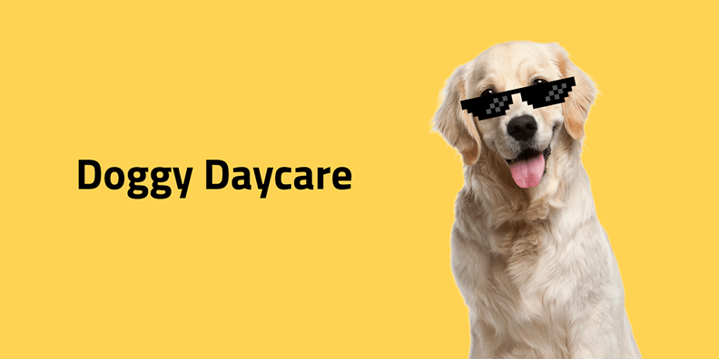

# Övning: Bygg ett Hunddagis i React och Next.js

## 🎯 **Mål med övningen**

I denna övning ska du bygga en webbapplikation för ett hunddagis med hjälp av **React** och **Next.js**. Applikationen kommer att:

- Hämta information om hundar från ett externt API (endast GET).
- Använda **App Router** och **dynamiska routes**.
- Hantera **state** för att visa om en hund är närvarande eller ej.
- Låta användaren navigera mellan olika hundprofiler.
- Implementera **sökfunktion** och **filtrering** baserat på närvarostatus.

**Figma-skiss för design:** [Figma-prototyp för Doggy Daycare](https://www.figma.com/design/rGB9ihkhMsmUGP5uYaeSDq/Doggy-Daycare?node-id=0-1&p=f&t=qND5WSBD03lMzgrU-0)

---

## 📝 **Steg-för-steg instruktioner**

### 1. **Skapa ett nytt Next.js-projekt**

1. Starta ett nytt Next.js-projekt med App Router:
   ```bash
   npx create-next-app@latest doggy-daycare
   ```
2. Välj TypeScript om du vill ha en extra utmaning.
3. Kör projektet:
   ```bash
   npm run dev
   ```

---

### 2. **Bygg Splash-sidan**

- Skapa en startsida (`app/page.js`) som visar en välkomstsida enligt Figma-skissen.
- Lägg till en knapp som leder till huvudsidan med alla hundar.

**Tips:** Använd `useRouter()` från `next/navigation` för att navigera mellan sidor.

---

### 3. **Hämta och visa alla hundar**

- Skapa en sida (`app/hundar/page.js`) som hämtar data från API:et med `fetch()` i `useEffect()` eller `server-side rendering` via `getServerSideProps`.

- Visa hundarna i kort enligt skissen, med:
  - Bild
  - Namn
  - Ras
  - Närvarostatus (t.ex. "✅ Närvarande" eller "❌ Frånvarande")

- Lägg till en **sökfunktion** som filtrerar hundarna efter namn eller ras.
- Implementera ett **filter** som låter användaren visa hundar baserat på närvarostatus.

**Krav:**
- Lägg till en länk på varje kort som leder till hundens individuella sida (`/hundar/[id]`).

---

### 4. **Bygg hundens profilsida**

- Skapa en **dynamisk route** `app/hundar/[id]/page.js`.
- Hämta data för den enskilda hunden från API:et baserat på ID:t från URL:en.
- Visa detaljerad information:
  - Namn, ras, ålder, beskrivning
  - Bild i större format
  - Närvarostatus

- Lägg till en **toggle-knapp** som ändrar närvarostatus **lokalt i state** (eftersom API:et endast stödjer GET kan vi inte uppdatera det på servern, så visa ändringen lokalt i UI:t).

- Inkludera navigation (t.ex. "Hund 2 av 134") och knappar för att bläddra mellan hundarna utan att gå tillbaka till huvudsidan.

**Tips:** Använd `useState` för att hantera närvarostatus och `useRouter()` eller `Link` för att navigera mellan hundprofiler.

---

### 5. **Navigering mellan hundprofiler**

- Implementera **nästa/föregående**-knappar som gör det möjligt att bläddra mellan hundarna direkt på profilsidan.
- Visa aktuell hunds position (exempel: "Hund 5 av 134").

**Bonus:** Hantera edge cases, t.ex. när användaren är på första eller sista hunden.

---

### 6. **Styla applikationen**

- Följ Figma-skissen för styling.
- Använd CSS-moduler eller annan stylingmetod som du föredrar (men **Tailwind CSS** är **inte** ett måste).

---

## 🌟 **Bonusutmaningar**

1. **Pagination:** Om API:et returnerar många hundar, implementera paginering.

2. **404-hantering:** Visa en 404-sida om ett ogiltigt hund-ID anges i URL:en.

3. **Loader-komponent:** Visa en loader/spinner när data hämtas från API:et.

---

## ✅ **Code review**

- Ni kommer att visa upp ert alster på fredag via en code review.
- Se till att ta tillvara på handledningstid och era klasskamrater!

---

## 💡 **Tips och resurser**

- [Next.js Documentation](https://nextjs.org/docs)
- [React Documentation](https://reactjs.org/docs/getting-started.html)
- [API-endpoint](https://majazocom.github.io/Data/dogs.json)

---

🚀 **Lycka till! Kom ihåg att bryta ner problemen i mindre delar och läsa felmeddelanden noggrant. Ni fixar det här!** 🐶✨

